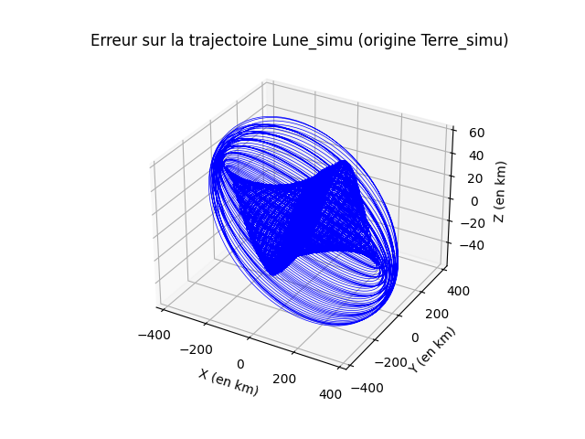
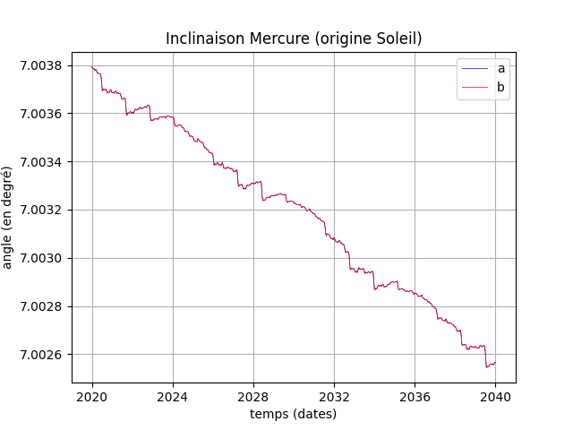
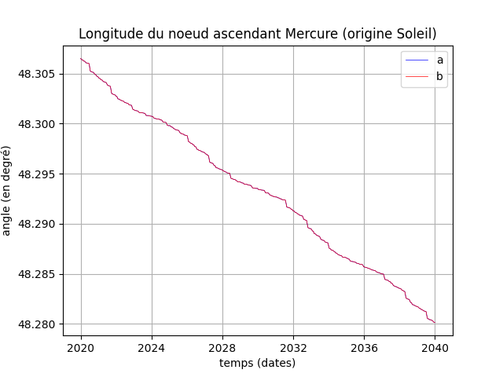

# Modèles numériques du système solaire

## Description

Aujourd'hui, les calculs d'éphémérides pour les planètes du système solaire font appel à des modèles où les équations différentielles résultant de l'application des lois de la physique sont intégrées numériquement. Ces modèles prennent en compte les effets relativistes via une [approximation post-newtonnienne](https://fr.wikipedia.org/wiki/%C3%89quations_d%27Einstein-Infeld-Hoffmann).

Parmi les modèles existants, citons celui de [l’**I**nstitut de **M**écanique **C**éleste et de **C**alcul des **E**phémérides (**IMCCE**)](https://www.imcce.fr/institut/presentation/) : **I**ntégrateur **N**umérique **P**lanétaire de l'**O**bservatoire de **P**aris ([modèle **INPOP**](https://www.imcce.fr/inpop)). Citons aussi celui du [**J**et **P**ropulsion **L**aboratory (**JPL**)](https://www.jpl.nasa.gov/) : **D**eveloppement **E**phemeris ([modèle **DE**](https://ssd.jpl.nasa.gov/)).

Le modèle du JPL étant associé à une [API](https://ssd-api.jpl.nasa.gov/doc/horizons.html) donnant facilement accès aux éphémérides, il sera utilisé ici pour effectuer des comparaisons avec un "modèle Newton", qui illustrera la modélisation par équation d'état et l'intégration numérique des équations différentielles ordinaires.

## Un "modèle Newton" simple

Chacun des $N$ astres inclus dans le modèle a une position $\vec{p_n}$ et une vitesse $\vec{v_n}$ dans le référentiel inertiel [ICRS](https://fr.wikipedia.org/wiki/Syst%C3%A8me_de_r%C3%A9f%C3%A9rence_c%C3%A9leste_international).

L'équation d'état qui régit le mouvement de ces astres fait aussi intervenir leur [paramètre gravitationnel standard](https://fr.wikipedia.org/wiki/Param%C3%A8tre_gravitationnel_standard) noté $\mu_k$ :

$$\dfrac{d\vec{p_n}}{dt}=\vec{v_n}$$

$$\dfrac{d\vec{v_n}}{dt}=\sum_{1\leq k \leq N,k \neq n}-\mu_k\dfrac{\vec{p_n}-\vec{p_k}}{\left\lVert\vec{p_n}-\vec{p_k}\right\lVert^3}$$

Ce modèle fait donc appel à la mécanique classique et aux lois de Newton pour la gravitation. Les valeurs des paramètres gravitationnels standards $\mu_k$ sont repris de l'article ["The JPL Planetary and Lunar Ephemerides DE440 and DE441"](https://iopscience.iop.org/article/10.3847/1538-3881/abd414/pdf) (Table 2, page 5).

Le programme de simulation qui résout numériquement l'équation d'état proposée permet de réaliser ensuite des comparaisons avec les [éphémérides fournies par le JPL](https://ssd.jpl.nasa.gov/horizons/app.html#/). Les conditions initiales pour les simulations numériques correspondent à la première ligne des fichiers importés du site du JPL, donc aux positions et vitesses des astres à la date de début choisie. Le pas de calcul pour les simulations numériques est le même que celui choisi pour les fichiers importés, afin de faciliter les comparaisons.

L'objectif est de montrer que la modélisation simplifiée qui est proposée donne cependant des résultats qui restent cohérents avec ces éphémérides très précises du JPL.

## Les programmes Python

### Le notebook

Dans le dossier **Notebook**, on trouvera le fichier **Systeme_solaire.ipynb**. Ce fichier est directement utilisable dans **Google Colaboratory**, par exemple. Son exécution génère en effet tous les fichiers de données nécessaires pour effectuer des comparaisons entre les éphémérides délivrées par le JPL et les résultats de simulation du "modèle Newton" proposé.

### Le code

Dans le dossier **Code**, on trouvera le fichier **astro.py** rassemblant toutes les fonctions permettant la récupération des éphémérides du **JPL** associées au modèle **DE**, les simulations numériques du "modèle Newton" et les comparaisons entre ces deux modèles.

Dans une console Python, il suffit d'importer le module "astro" avec la ligne ci-dessous.
```
>>> import astro
```

Le fichier **lance_astro.py** donne des exemples d'appel aux différentes fonctions disponibles dans ce module.

### Les données initiales du "modèle Newton"

Le fichier **Planetes.csv** peut être généré "à la main" ou via la fonction **astro.planetes()**. Il comprend la liste des planètes prises en compte dans le "modèle Newton". La colonne "id" est un identifiant que l'on peut récupérer avec la fonction **astro.liste_id()**.
```
>>> import astro
>>> astro.planetes(Planetes='Planetes.csv')
       Nom            mu      units   id
0   Soleil  1.327124e+11  km^3 s^-2   10
1  Mercure  2.203187e+04  km^3 s^-2    1
2    Venus  3.248586e+05  km^3 s^-2    2
3    Terre  3.986004e+05  km^3 s^-2  399
4     Lune  4.902800e+03  km^3 s^-2  301
5     Mars  4.282838e+04  km^3 s^-2    4
6  Jupiter  1.267128e+08  km^3 s^-2    5
7  Saturne  3.794058e+07  km^3 s^-2    6
8   Uranus  5.794556e+06  km^3 s^-2    7
9  Neptune  6.836527e+06  km^3 s^-2    8
```

### Les éphémérides du JPL

Via des requêtes internet, les données relatives aux planètes présentes dans le fichier **Planetes.csv** sont téléchargées, puis stockées dans des fichiers **\<planete\>.csv**. On précise les dates de début et de fin, ainsi que le pas temporel.

```
>>> import astro
>>> astro.convert_req_jpl_to_csv(Planetes='Planetes.csv', debut='2020-01-01 00:00:00', fin='2040-01-01 00:00:00', pas='8 h')
Données pour Soleil
Données pour Mercure
Données pour Venus
Données pour Terre
Données pour Lune
Données pour Mars
Données pour Jupiter
Données pour Saturne
Données pour Uranus
Données pour Neptune
```

Les informations récupérées à chaque instant précisé dans la colonne **DATES** sont des coordonnées **X**, **Y** et **Z**, exprimées en km. Les vitesses **VX**, **VY** et **VZ** sont exprimées en km/s. La colonne **JDTDB** (Julian Date for Barycentric Dynamical Time) ne sera pas utilisée.

```
>>> astro.lire_info_csv('Terre.csv')
              JDTDB                DATES             X             Y             Z         VX        VY        VZ
0      2.458850e+06  2020-01-01 00:00:00 -2.545334e+07  1.460913e+08  -2712.536258 -29.863382 -5.165822  0.001136
1      2.458850e+06  2020-01-01 08:00:00 -2.631296e+07  1.459400e+08  -2680.799361 -29.832140 -5.340013  0.001068
2      2.458850e+06  2020-01-01 16:00:00 -2.717166e+07  1.457837e+08  -2651.026490 -29.799858 -5.513965  0.000999
3      2.458850e+06  2020-01-02 00:00:00 -2.802942e+07  1.456224e+08  -2623.259867 -29.766539 -5.687670  0.000929
4      2.458851e+06  2020-01-02 08:00:00 -2.888621e+07  1.454561e+08  -2597.532568 -29.732188 -5.861122  0.000858
...             ...                  ...           ...           ...           ...        ...       ...       ...
21911  2.466153e+06  2039-12-30 16:00:00 -2.007063e+07  1.452651e+08 -40698.080428 -29.950605 -4.369779 -0.000406
21912  2.466154e+06  2039-12-31 00:00:00 -2.093284e+07  1.451368e+08 -40709.007441 -29.924926 -4.543662 -0.000352
21913  2.466154e+06  2039-12-31 08:00:00 -2.179430e+07  1.450034e+08 -40718.301385 -29.898268 -4.717404 -0.000293
21914  2.466154e+06  2039-12-31 16:00:00 -2.265497e+07  1.448650e+08 -40725.830298 -29.870632 -4.891003 -0.000229
21915  2.466154e+06  2040-01-01 00:00:00 -2.351484e+07  1.447217e+08 -40731.467570 -29.842019 -5.064455 -0.000161

[21916 rows x 8 columns]
```

### Les simulations numériques

La méthode de résolution numérique de l'équation différentielle associée au "modèle Newton" peut alors être lancée. Les conditions initiales sont obtenues en considérant la première ligne de tous les fichiers **\<planete\>.csv**. Le pas de calcul est constant et vaut le pas choisi pour ces fichiers lors de leur téléchargement. La méthode peut être "rk4" ou "rk8" (voir le fichier astro.py pour les détails).

```
>>> astro.simu_systsol_save(Planetes='Planetes.csv', methode='rk8')
Soleil : 132712440041.2794 km^3 s^-2
Mercure : 22031.868551 km^3 s^-2
Venus : 324858.592 km^3 s^-2
Terre : 398600.435507 km^3 s^-2
Lune : 4902.800118 km^3 s^-2
Mars : 42828.375816 km^3 s^-2
Jupiter : 126712764.1 km^3 s^-2
Saturne : 37940584.8418 km^3 s^-2
Uranus : 5794556.4 km^3 s^-2
Neptune : 6836527.10058 km^3 s^-2
début de la simulation numérique
fin de la simulation à 0:02:23.666915 (hh:mm:ss.ms)
```

Les résultats de cette résolution sont stockés dans des fichiers **\<planete\>_simu.csv**.

### Les comparaisons

#### Comparaison sur les trajectoires

La trajectoire simulée et les écarts à la trajectoire fournie par le JPL sont représentés.

```
>>> astro.compare(Astre1_a='Terre',Astre2_a='Lune',Astre1_b='Terre_simu',Astre2_b='Lune_simu')
```





#### Comparaison sur les paramètres orbitaux

On remarquera l'écart de 8,6 secondes d'arc sur la longitude du périhélie de Mercure, au bout de 20 ans. Cet écart est alors de 43 secondes d'arc sur 100 ans, ce qui correspond bien à l'écart qu'avait constaté Urbain le Verrier, entre les prédictions d'un modèle fondé sur les lois de Newton et l'observation.

```
>>> astro.param_orb_comp(Astre1_a='Soleil', Astre2_a='Mercure', Astre1_b='Soleil_simu', Astre2_b='Mercure_simu',Planetes='Planetes.csv')
```






#### Comparaison avec une orbite de Képler 

Pour évaluer la précision des méthodes de résolution numérique, le calcul exact d'une orbite avec seulement deux astres présents (voir [Mouvement képlerien](https://fr.wikipedia.org/wiki/Mouvement_k%C3%A9pl%C3%A9rien)) peut être comparée avec la résolution numérique du même problème.

On génère par exemple les fichiers **Soleil_k.csv** et **Mercure_k.csv** correspondant à une orbite de Képler fictive où Mercure seule tourne autour du Soleil, avec les conditions initiales lues dans la première ligne des fichiers **Mercure.csv** et **Soleil.csv**
```
astro.orbite_kepler(Astre1='Soleil', Astre2='Mercure', Planetes='Planetes.csv',Astre1_k='Soleil_k', Astre2_k='Mercure_k', Planetes_k='Planetes_sol_mer.csv')
```

On réalise une simulation numérique directe du mouvement dans les mêmes conditions.
```
astro.simu_systsol_save(Planetes='Planetes_sol_mer.csv', methode='rk8')
```

On compare la solution exacte à la solution obtenue par résolution numérique directe des équations du mouvement.
```
astro.compare(Astre1_a='Soleil_k', Astre2_a='Mercure_k',Astre1_b='Soleil_k_simu', Astre2_b='Mercure_k_simu')
```


L'erreur est d'environ 2 mètres au bout de 20 ans.

